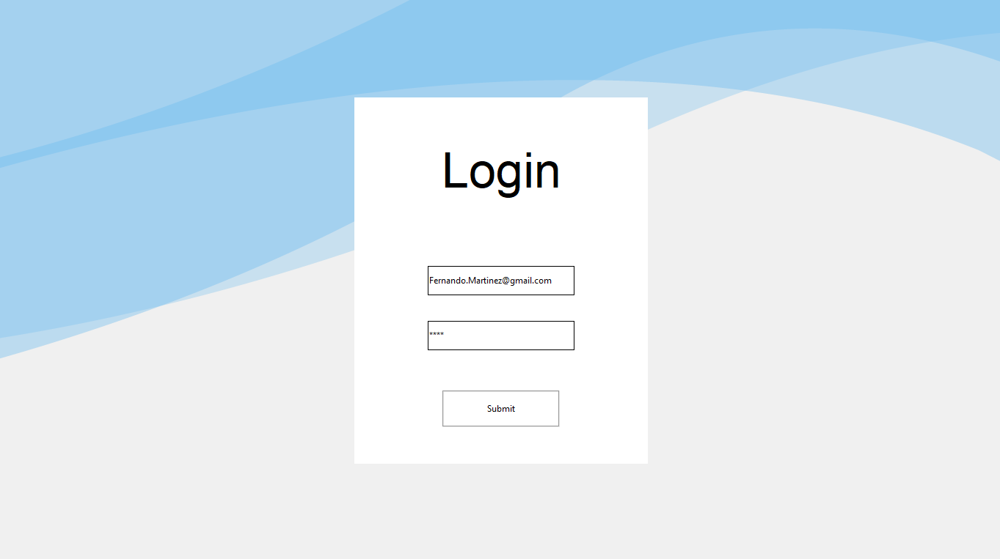
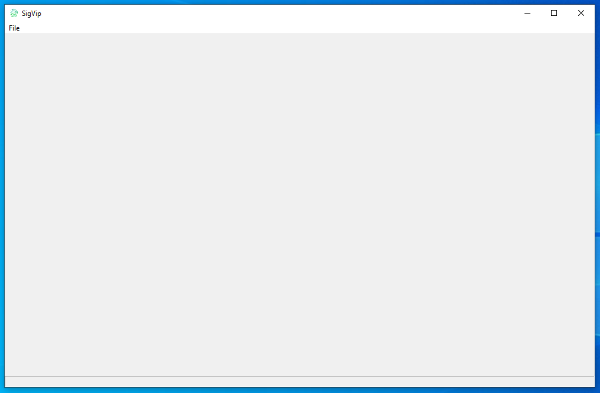
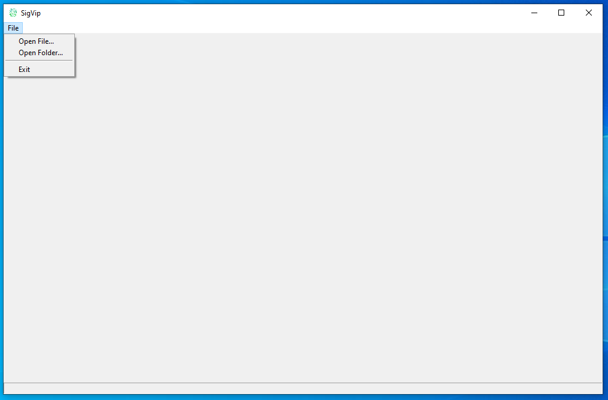
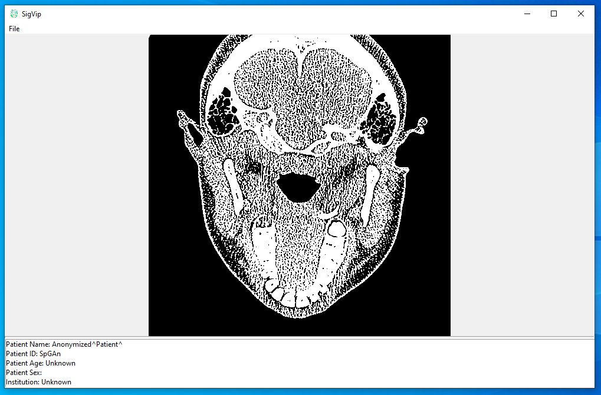

# Desktop SigVip Project 💻
 

## Objetivo 🎯
* Crear un visualizador de imágenes DICOM para escritorio.
 
 

# Comencemos 🚀
 

## Desarrollado en 🛠️
* Python

## Librerías de Python necesarias 📚 
* pydicom
* numpy
* Pillow

## Algunas imágenes de Desktop SigVip Project 🚧
 

- ***Login*** 

- ***Home*** 

- ***Menú*** 

- ***Imagen*** 
