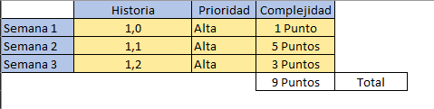
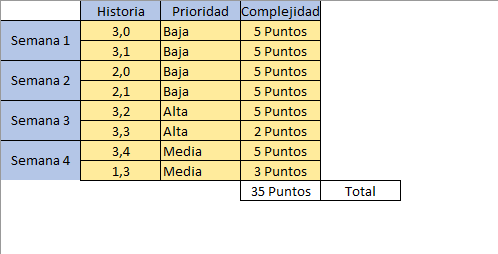
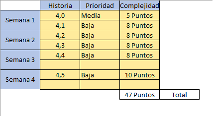

# Backlog 📅
Esta carpeta contiene:
* Backlog.xlsx (Excel).
* Imagen del backlog.
* Imagen del Sprint 1 del primer semestre.
* Imagen del Sprint 1 del segundo semestre.
---
 
 

# Backlog
 
# Sprint 1 (Primer semestre). ✅

# Sprint 1 (Segundo semestre). ✅

# Sprint 2 (Segundo semestre). ⚠️✋
