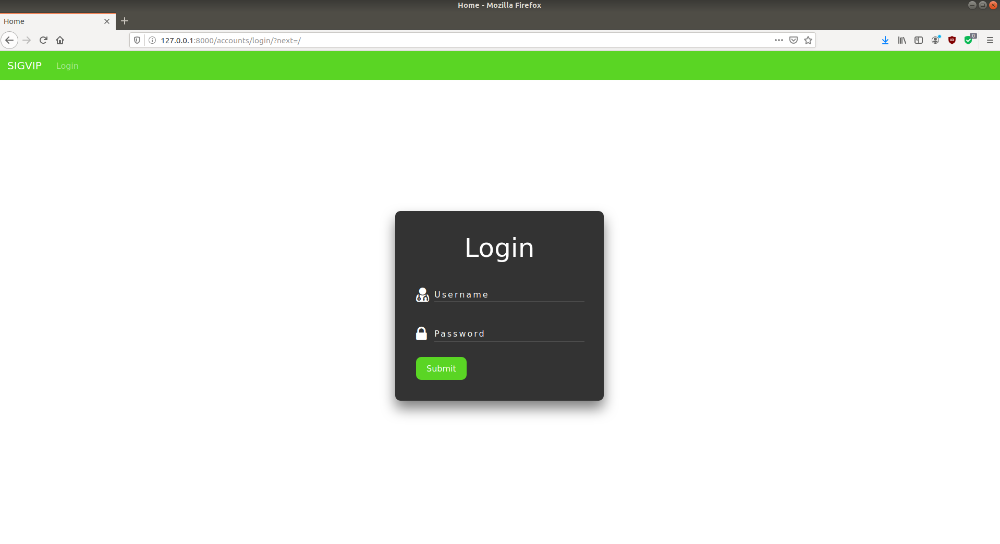
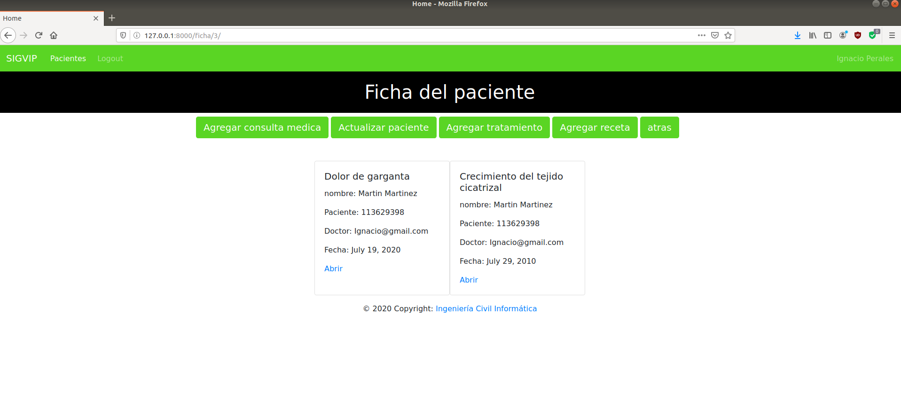

# Página web "SigVip" desarrollada en Django
SigVip (sistema  para la gestión y visualización de imágenes de pacientes)
 
## Objetivo del hito 3
* El objetivo en el primer semestre era desarrollar para el proyecto una página web para la empresa INRAD, con el objetivo de que puedan los doctores ver las fichas de sus pacientes, las consultas médicas, crear recetas médicas y tratamientos.
 
 
 
 
# Instrucciones para ejecutar y navegar por la página web
### Para iniciar la aplicacion (pagina web) es necesario activar el entorno virtual.
En este entorno se encuentran instaladas librerías de python, que requiere la pagina para funcionar.
Para activar el entorno debe ejecutar el siguiente código:
 
<pre><code># linux
source venv/bin/activate
</pre></code>
 
<pre><code># Win
venv/Scripts/activate
</pre></code>
 
### ¡Es importante que sepa que si usted está en una computadora con sistema operativo windows, antes de ejecutar el código usted tendrá que crear el entorno virtual, activarlo con el código anterior e instalar las librerías que requiere para funcionar!
No se preocupe, en la carpeta se encuentra un archivo .TXT (requirements.txt) con el cual podrá instalar las librerias que necesita para ejecutar la página web.
 
<pre><code># Win
#Recuerde que debe tener instalada virtualenv
   >>> pip3 install virtualenv
 
#Crear el entorno virtual
   >>> virtualenv venv
 
#Activar el entorno virtual
   >>> venv/Scripts/activate o venv/Scripts/activate.bat
 
#Instalar las librerias necesarias
   >>> pip3 install -r requirements.txt
</pre></code>
 
Luego de este paso solo nos falta ingresar a la carpeta SigVip/ y ejecutar el siguiente comando:
 
<pre><code># Win & linux
python manage.py runserver
</pre></code>
 
Ahora abrimos el navegador y accedemos al localhost -> [http://127.0.0.1:8000/](http://127.0.0.1:8000/)
 
Al ingresar a la página nos encontraremos con un login para poder acceder a la cuenta del doctor.
La página cuenta con dos tipos de usuarios:
* El usuario administrador
* El usuario doctor
 
¿Por qué? porque, para que un doctor tenga una cuenta en la página, este debió ser ingresado al sistema por un administrador.
 
El usuario administrador podrá ingresar al login de django (admin) -> [http://127.0.0.1:8000/admin](http://127.0.0.1:8000/admin)
 
El usuario doctor no podrá ingresar al login admin.
El o los administradores se encargaran de llenar algunos campos como: "los tipos de exámenes", para que al doctor se le despliegue una lista de tipos de exámenes o tambien para ingresar al sistema a los médicos.
 
## Usuario administrador :
<pre>Usuario : Fernando@gmail.com
Contraseña : 1234</pre>
 
El usuario doctor en su cuenta puede ver las fichas de los pacientes, puede agregar pacientes a la DataBase, también puede agregar recetas, tratamientos, consultas médicas, editar y eliminarlas también.
 
## Usuario doctor :
<pre>Usuario : Ignacio@gmail.com
Contraseña : Megustaprogramar</pre>
 
El sistema verificará la contraseña y usuario si son correctos, de ser así, estos serán redirigidos a una página de bienvenida.
### Login

### Página de bienvenida

 
Luego para ver a los pacientes, usted deberá hacer click en donde dice "pacientes", en este apartado el usuario podrá abrir, buscar y registrar a los pacientes.
 
### Página de pacientes

 
Cuando pinchamos en el link "Ir" del paciente, el usuario será redirigido a la ficha del paciente, el cual contiene el "historial médico" del paciente.
En esta página usted podrá editar los datos personales del paciente, también tiene la posibilidad de agregar recetas médicas, tratamientos, para luego crear consultas médicas.
 
### La ficha

 
Si usted hace click en el enlace "abrir" de algunas de las consultas médicas que dispone el paciente, podrá ver el detalle de esta y tendra tambien la posibilidad de editarla y/o eliminarla.
 
### Detalle de la consulta médica

 
Por último, si usted desea cerrar la sesión de su cuenta, solo debe hacer click en "Logout" y será redirigido al login inicial.
