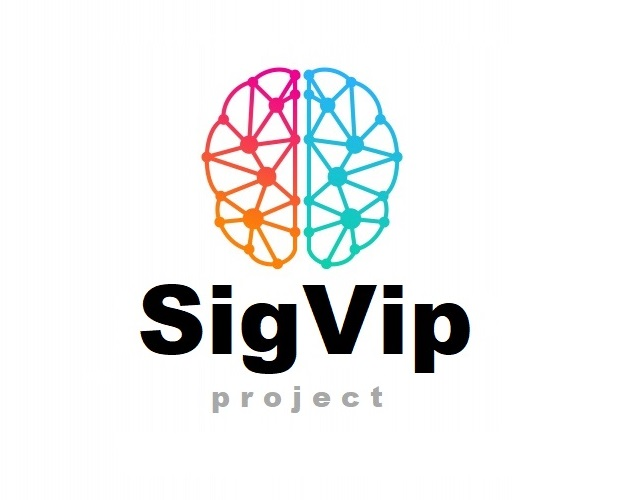

# Sistema para la visualización de imágenes de pacientes de Radioterapia
## ICF232_202010_Grupo10
* Proyecto para el ramo de Ingeniería de software.

## Documentos 📂
Esta carpeta contiene:
* Carpeta [Backlog](https://github.com/White-Mask/ICF232_202010_Grupo10/tree/master/Documentos/Backlog)
* Carpeta [Mapa de Historias](https://github.com/White-Mask/ICF232_202010_Grupo10/tree/master/Documentos/Mapa%20de%20Historias)
* Carpeta [Modelo 4+1](https://github.com/White-Mask/ICF232_202010_Grupo10/tree/master/Documentos/Modelo%204%2B1)
* Carpeta [Diseño caso de pruebas](https://github.com/White-Mask/ICF232_202010_Grupo10/tree/master/Documentos/Dise%C3%B1o%20caso%20de%20pruebas)
    * El documento de caso de pruebas (.xlsx)
* El documento de visión.
* El documento de casos de uso.

## Videos 🎥
Esta carpeta contiene:
* Presentación del proyecto.mp4 (Hito 2).

## Web SigVip Project 🚧
Esta carpeta contiene:
* Carpeta [Web SigVip Project](https://github.com/White-Mask/ICF232_202010_Grupo10/tree/master/Web%20SigVip%20Project)
* El archivo [README.md](https://github.com/White-Mask/ICF232_202010_Grupo10/blob/master/Web%20SigVip%20Project/README.md)

## Desktop SigVip Project 🚧
Esta carpeta contiene:
* Carpeta [Desktop SigVip Project](https://github.com/White-Mask/ICF232_202010_Grupo10/tree/master/Desktop%20SigVip%20Project)
* El archivo [README.md](https://github.com/White-Mask/ICF232_202010_Grupo10/blob/master/Desktop%20SigVip%20Project/README.md)

## Trello 📝
* Link de acceso al [SIGVIP Trello](https://trello.com/b/GpgYn9OR/sigvip)

## Hito 2
* Reporte sprint 2 [Hito 2](https://github.com/White-Mask/ICF232_202010_Grupo10/blob/master/Hito_2.docx)

## Hito 3
* Reporte sprint 3 [Hito 3](https://github.com/White-Mask/ICF232_202010_Grupo10/blob/master/Hito_3.docx)
