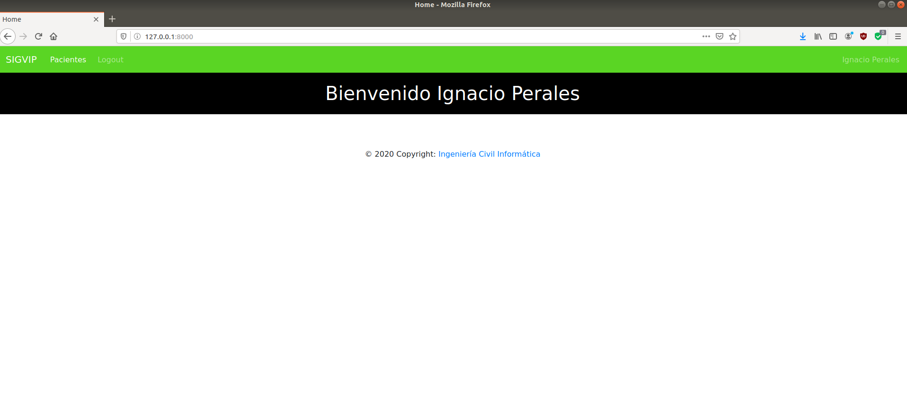
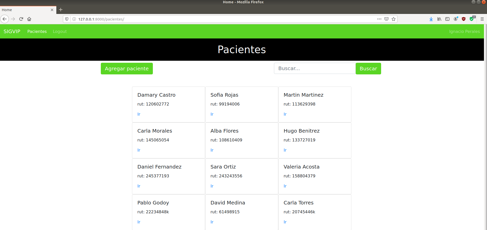
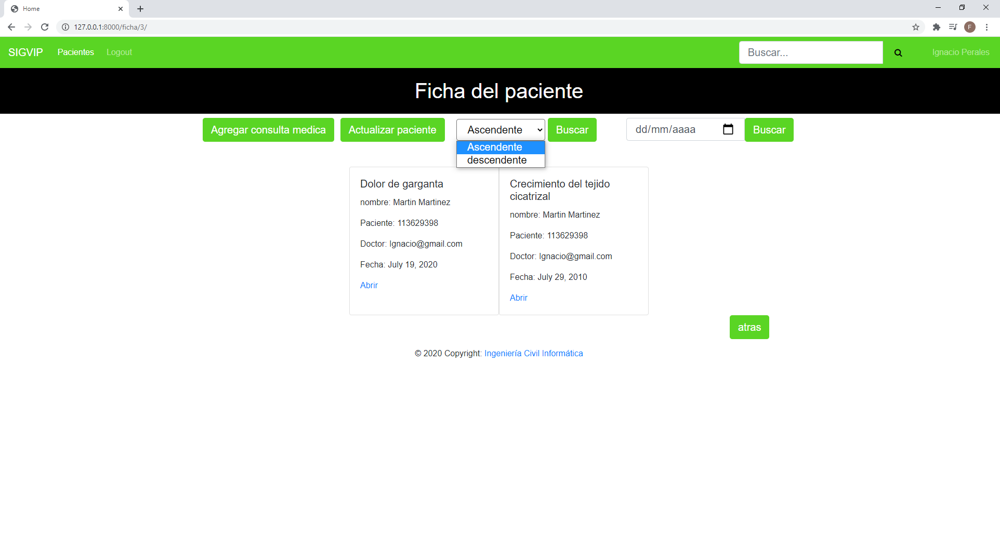

# SigVip
Sistema para la gestión y visualización de imágenes de pacientes.
 
## Objetivos 🎯
* Desarrollar una página web para la empresa INRAD, con el objetivo de que los doctores puedan ver las fichas medicas de sus pacientes, las consultas médicas, agregar tratamientos y recetas médicas.
* Desarrollar una aplicación de escritorio para que los doctores puedan visualizar, comparar y manipular las imágenes DICOM (.dcm).
 
 
 

# Comencemos 🚀
## Pre-requisitos ❗
* [python3](https://www.python.org/)
* [virtualenv](https://pypi.org/project/virtualenv/)
### Para iniciar la aplicación (página web) es necesario crear el entorno virtual.
En este entorno debe instalar las librerías de Python que requiere la página para funcionar, las librerías que necesitamos se encuentran en el archivo requirements.txt.

Para crear el entorno e instalar las librerías debe ejecutar los siguientes comandos:
<pre><code># Win
#Recuerde que debe tener instalada virtualenv
   >>> pip3 install virtualenv
 
#Crear el entorno virtual
   >>> virtualenv venv
 
#Activar el entorno virtual
   >>> venv/Scripts/activate o venv/Scripts/activate.bat
 
#Instalar las librerías necesarias
   >>> pip3 install -r requirements.txt

# Linux
#Activar el entorno virtual
   >>> source venv/bin/activate
</pre></code>

Para ejecutar la página debe ingresar a la carpeta SigVip/ y ejecutar el siguiente comando:
 
<pre><code># Win & linux
python manage.py runserver
</pre></code>
 
Ahora abrimos el navegador y accedemos al localhost -> [http://127.0.0.1:8000/](http://127.0.0.1:8000/)
 
Al ingresar a la página nos encontraremos con un login para acceder a la cuenta del doctor.
La página cuenta con dos tipos de usuarios:
* El usuario administrador
* El usuario doctor
 
El usuario administrador podrá ingresar al login de django admin -> [http://127.0.0.1:8000/admin](http://127.0.0.1:8000/admin)
El usuario doctor no podrá ingresar al login admin.

 

# Navegar por la página web 🌐
## Usuario administrador:
El usuario administrador puede crear, modificar y eliminar doctores.
<pre>Usuario: Fernando@gmail.com
Contraseña: 1234</pre>
 
El usuario doctor puede:
* Agregar pacientes, consultas médicas, tratamientos y recetas a la base de datos.
* Editar y eliminarlas los campos mencionados anteriormente.
* Visualizar las fichas, consultas, tratamientos y recetas de los pacientes.
 
## Usuario doctor:
<pre>Usuario: Ignacio@gmail.com
Contraseña: Megustaprogramar</pre>
 
El sistema verificará el usuario y la contraseña, si son correctos serán redirigidos a una página de bienvenida.
### Login

### Página de bienvenida

 
Luego para ver a los pacientes, usted deberá hacer clic en donde dice "pacientes", en este apartado el usuario podrá abrir, buscar y registrar a los pacientes.
 
### Página de pacientes

 
Cuando pinchamos en el link "Ir" del paciente, el usuario será redirigido a la ficha del paciente, el cual contiene el "historial médico" del paciente.
En esta página usted podrá editar los datos personales del paciente, agregar consultas médicas y también buscar las consultas médicas por fecha.
 
### La ficha

 
Si usted hace clic en el enlace "abrir" de algunas de las consultas médicas que dispone el paciente, podrá ver el detalle de esta y tendrá también la posibilidad de editarla y/o eliminarla.
 
### Detalle de la consulta médica

 
Por último, si usted desea cerrar la sesión de su cuenta, solo debe hacer clic en "Logout" y será redirigido al login inicial.

 

# Desarrollado en 🛠️
* [Python](https://www.python.org/)
* [Django](https://www.djangoproject.com/)
